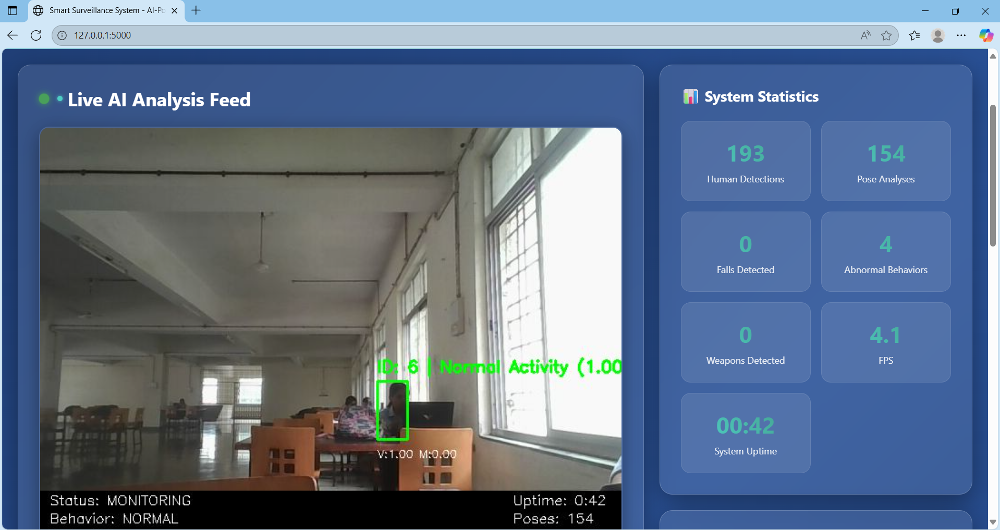
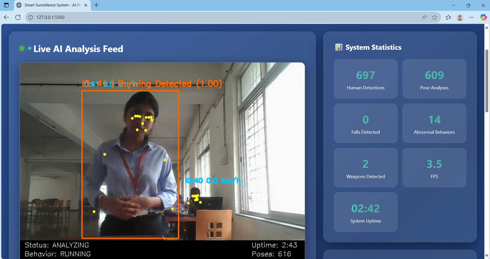
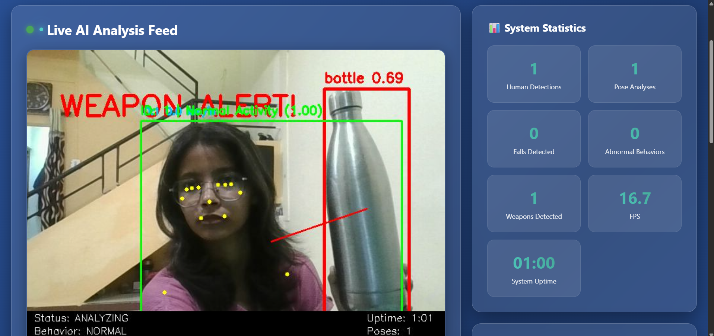
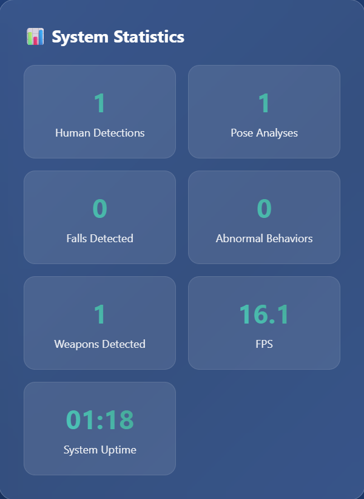
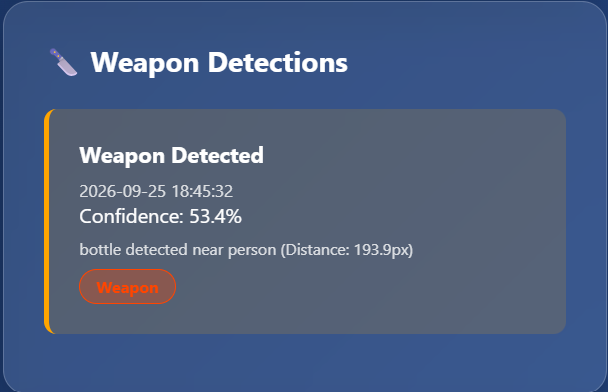
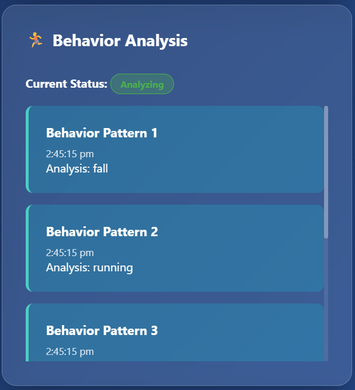
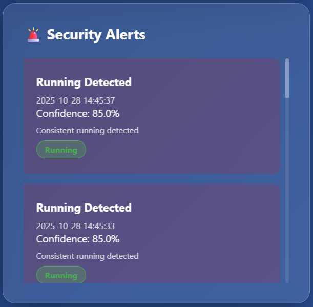

# 🛡️ Intelligent Smart Surveillance System

An AI-powered real-time surveillance system that integrates:

* 🧍 Human detection
* 🤸 Pose-based behavior analysis
* 🔪 Hazardous object (weapon) detection
* 🏃 Speed and motion estimation

All combined into a **live monitoring dashboard** for intelligent surveillance.
> This project demonstrates building a real-time AI system with backend integration and automated decision-making, aligned with production AI workflows.

---

## 🚀 Features

* 🎥 Real-time video streaming (Webcam)
* 🧍 Human detection using YOLOv8
* 🤸 Pose estimation using MediaPipe
* 🚨 Fall detection & abnormal behavior detection
* 🏃 Running / high-speed movement detection
* 🔪 Hazardous object detection (knife, tools, etc.)
* 📏 Speed estimation using motion tracking
* 📊 Live dashboard with alerts and system stats
* 🔔 Alert logging system
* 📁 Data storage:

  * Pose sequences
  * Alerts
  * Reports

---

## 📸 Demo Preview

### 🧠 Live AI Detection (Normal Activity)


---

### 🏃 Behavior Detection (Running)


---

### 🔪 Weapon Detection Alert


---

### 📊 System Statistics Dashboard


---

### ⚠️ Weapon Detection Logs


---

### 🤸 Behavior Analysis Panel


---

### 🚨 Security Alerts Panel


---

## 🧠 Tech Stack

* Python 3.10 (recommended via Anaconda)
* Flask (Backend + API)
* OpenCV (Video processing)
* YOLOv8 (Ultralytics)
* MediaPipe (Pose estimation)
* NumPy, Pandas, Scikit-learn
* HTML, CSS, JavaScript (Frontend)

---

## 📁 Project Structure

```
EnhancedSmartSurveillance/
│
├── app.py
├── object_detector.py
├── speed_estimator.py
├── label_generator.py
├── knife.yaml
│
├── templates/
│   └── index.html
│
├── static/
│
├── data/
│   ├── pose_sequences/
│   ├── alerts/
│   └── reports/
│
├── models/
│
├── requirements.txt
└── README.md
```

---

## ⚙️ Setup Instructions

### 1️⃣ Clone the Repository

```bash
git clone https://github.com/payaldongre/EnhancedSmartSurveillance.git
cd EnhancedSmartSurveillance
```

---

### 2️⃣ Create Environment

```bash
conda create --prefix ./env python=3.10
conda activate ./env
```

---

### 3️⃣ Install Dependencies

```bash
pip install -r requirements.txt
```

---

### 4️⃣ Fix PyTorch Compatibility (IMPORTANT)

```bash
pip install torch==2.5.1 torchvision==0.20.1 torchaudio==2.5.1 --extra-index-url https://download.pytorch.org/whl/cpu
```

---

## ▶️ Run the Project

```bash
# Navigate to project folder
cd EnhancedSmartSurveillance

# Activate environment
conda activate ./env

# Run application
python app.py
```

---

## 🌐 Access Dashboard

After running, open:

* Local:

```
http://localhost:5000
```

* Same network (optional):

```
http://<your-ip-address>:5000
```

Example:

```
http://192.168.1.5:5000
```

---

## 📡 API Endpoints

| Endpoint                 | Description        |
| ------------------------ | ------------------ |
| `/`                      | Dashboard          |
| `/video_feed`            | Live video stream  |
| `/api/stats`             | System statistics  |
| `/api/alerts`            | Alert logs         |
| `/api/weapon_detections` | Weapon alerts      |
| `/api/behavior_history`  | Behavior tracking  |
| `/api/test_alert`        | Trigger test alert |
| `/api/clear_alerts`      | Reset alerts       |

---

## 🎯 Detection Capabilities

### 🧍 Human Detection

* YOLOv8-based detection

### 🤸 Behavior Analysis

* Normal activity
* Abnormal behavior
* Running detection
* Fall detection

### 🔪 Hazard Detection

* Detects:

  * Knife
  * Tools / objects
* Triggers alerts when near a person

### 🏃 Speed Estimation

* Motion tracking across frames
* Based on:

  * Pixel displacement
  * Pose normalization
  * Temporal smoothing

---

## ⚠️ Important Notes

* Python **3.10 recommended** (avoid 3.13)
* Webcam must be available
* Close other apps using camera
*

👉 **YOLO weights will be downloaded automatically on first run.**

---

## 🧪 Testing

* Start the system and open dashboard
* Try:

  * Fast movement → running detection
  * Sudden fall → fall detection
  * Object in hand → weapon detection

---

## 📌 Future Scope

* ESP32-CAM integration
* Multi-camera support
* Cloud deployment
* SMS / Email alerts
* Database integration

---

## 👩‍💻 Contributors

* Payal Dongre
* Priyanka Jadhav

---

## 🏁 Summary

A real-time intelligent surveillance system combining:

* Object detection
* Pose estimation
* Behavior analysis
* Motion tracking

into a unified monitoring solution.

---

> Note: Large files, model weights, and environment folders are excluded using `.gitignore` for efficient repository management.